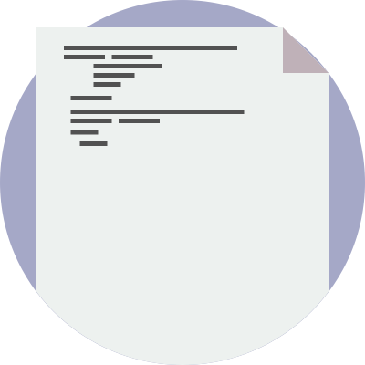
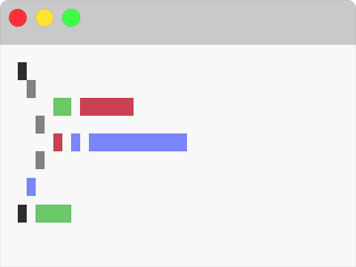

#FileIcons#

Flat icons for files and documents. Made by <a href="http://mkaminsky11.github.io">Michael Kaminsky</a>.
<<<<<<< HEAD
=======

These icons were originally for the <a href="https://github.com/mkaminsky11/codeyourcloudmobile">Code Your Cloud mobile app</a>. However, I decided to release them on their own for others to use.

####Arduino (new)####
```html

```


####Swift (updated)####
```html

```


####Python (new)####
```html

```


####Haskell (new)####
```html

```


####C++ (new)####
```html

```


####C (new)####
```html

```


####Server (new)####
```html

```


####Dart (new)####
```html

```


####Git####
```html

```


####Git Folder####
```html

```


####PHP####
```html

```


####Ruby####
```html

```

>>>>>>> 888bb1d13c68e192880c4f1133b3be46f7caf899

These icons were originally for the <a href="https://github.com/mkaminsky11/codeyourcloudmobile">Code Your Cloud mobile app</a>. However, I decided to release them on their own for others to use.

Most of these icons are hand-made, but a couple (such as the Ruby file) use the actual logos.

####Presentation (updated)####
```html

```


####SpreadSheet (updated)####
```html

```


####Code File (new)####
```html

```


####Document (updated)####
```html

```


####Javascript (updated)####
```html

```


####CSS (updated)####
```html

```


####HTML (updated)####
```html

```


####Java (new)####
```html

```


####Arduino####
```html

```


####Swift####
```html

```


####Python####
```html

```


####Haskell####
```html

```


####C++####
```html

```


####C####
```html

```


####Server####
```html

```


####Dart####
```html

```


<<<<<<< HEAD
####Git####
```html

```


####Git Folder####
```html

```


####PHP####
```html

```


####Ruby####
```html

```


####CoffeeScript####
=======
####Key####
>>>>>>> 888bb1d13c68e192880c4f1133b3be46f7caf899
```html

```
<<<<<<< HEAD


####Generic File####
```html

```


####Folder####
```html

```


####Image####
```html

```


####ZIP####
```html

```


####Editor####
```html

```


####Key####
```html

```
=======
>>>>>>> 888bb1d13c68e192880c4f1133b3be46f7caf899
